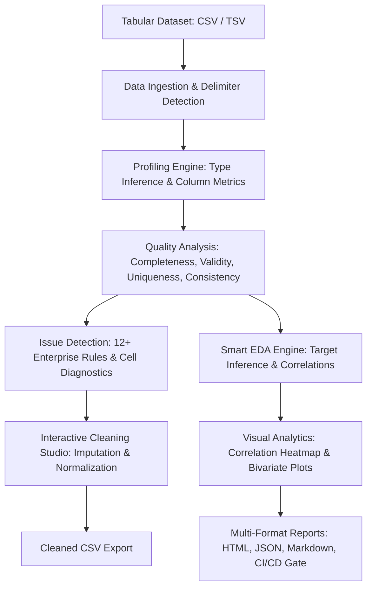

# Data Sarthi

## Enterprise Data Quality, Issue Detection & Smart EDA Platform

[](https://www.python.org/)
[](https://developer.mozilla.org/en-US/docs/Web/JavaScript)
[](https://developer.mozilla.org/en-US/docs/Web/HTML)
[](https://developer.mozilla.org/en-US/docs/Web/CSS)
[](https://vercel.com/)
[](tests/)
[](LICENSE)

---

## 1. Overview

**Data Sarthi** is an enterprise-oriented data quality and Smart EDA platform designed to help users understand, validate, and improve datasets before downstream analytics and machine-learning workflows.

Built with a lightweight, zero-dependency native architecture, Data Sarthi scans millions of tabular data cells in milliseconds. It computes dimensional health scores across four critical axes (Completeness, Validity, Uniqueness, Consistency), isolates granular cell-level anomalies with remediation guidance, automatically infers modeling targets through deterministic heuristics, generates Pearson correlation matrices, and delivers browser-based visual analytics and automated data sanitization workflows.

---

## 2. Key Capabilities

- **⚡ Blazing Fast In-Memory Profiling**: Processes large datasets with sub-second latency using pure native standard libraries.
- **🛡️ Multi-Dimensional Health Scoring**: Computes a transparent, weighted 0–100 Data Health Index.
- **🔍 Deep Anomaly & Issue Detection**: Diagnoses cell-level issues across 12+ enterprise validation rules.
- **🎯 Deterministic Smart EDA**: Automatically infers target candidates, problem types, and bivariate feature interactions.
- **📈 Interactive Visual Analytics**: Built-in SVG chart rendering for correlation heatmaps, scatter plots with trend lines, class distributions, and histograms.
- **🧹 Non-Destructive Data Cleaning**: In-memory data sanitization (whitespace trimming, case normalization, deduplication, missing imputation) with instant CSV export.
- **📋 Multi-Format Auditing**: Generates standalone executive HTML reports, machine-readable JSON audit payloads, Markdown summaries, and CSV metrics.
- **🚀 Dual Deployment Architecture**: Runs natively as a local multi-threaded Python server or deploys instantly to Vercel as a zero-build static web studio.

---

## 3. Why Data Sarthi

Modern machine learning models and business intelligence pipelines frequently fail due to silent data degradation—unseen missing values, casing variants, unparseable date formats, and negative numbers in non-negative domains. 

Traditional profiling tools are often heavy, requiring multi-gigabyte scientific dependencies, long compilation pipelines, or third-party cloud data transfer.

**Data Sarthi solves this by providing:**
1. **Zero Dependencies**: Pure Python 3 Standard Library backend and native ES6+ browser runtime—no compilation required.
2. **Privacy-First In-Memory Processing**: Data remains local and is analyzed in-memory or directly within the user's browser.
3. **Actionable Remediation**: Does not just report errors—provides exact remediation steps, cell pointers, and automated cleaning recipes.
4. **Transparent Statistical Heuristics**: Deterministic target ranking and statistical insight generation without ambiguous black-box outputs.

---

## 4. Core Features

| Feature | Description |
|:---|:---|
| **Data Ingestion** | Drag-and-drop CSV, TSV, and delimited file parsing with auto-delimiter detection. |
| **Cell Diagnostics** | Interactive cell-level inspector detailing severity, rule triggered, and remediation advice. |
| **Target Scoring** | Ranks target candidate columns by entropy, cardinality, and naming conventions. |
| **Correlation Heatmap** | Interactive Pearson correlation matrix with ranked bivariate relationships. |
| **Data Cleaning Studio** | In-memory whitespace trimming, case standardizing, deduplication, and missing value imputation. |
| **Automated Reports** | Exportable standalone HTML reports, JSON schemas, Markdown summaries, and cleaned CSVs. |
| **CI/CD Quality Gates** | Terminal CLI scanner (`dq_scan.py`) suitable for automated pre-merge data pipelines. |

---

## 5. Smart EDA (Exploratory Data Analysis)

Data Sarthi features a deterministic, non-causal Smart EDA engine that structures statistical exploration:

```
┌─────────────────────────────────────────────────────────────┐
│                       SMART EDA ENGINE                      │
├──────────────────────────────┬──────────────────────────────┤
│ 1. Target Candidate Scoring  │ Scores columns by entropy,   │
│                              │ cardinality, and keywords.   │
├──────────────────────────────┼──────────────────────────────┤
│ 2. Problem Type Inference    │ Binary Classification,       │
│                              │ Multiclass, Regression,      │
│                              │ Time-Series, or Exploratory. │
├──────────────────────────────┼──────────────────────────────┤
│ 3. Correlation Analysis      │ Pairwise Pearson matrix ($r$)│
│                              │ with ranked strongest pairs. │
├──────────────────────────────┼──────────────────────────────┤
│ 4. Bivariate Plotting        │ Scatter (Num × Num),         │
│                              │ Class Box/Stats (Num × Cat), │
│                              │ Cross-tabs (Cat × Cat).      │
├──────────────────────────────┼──────────────────────────────┤
│ 5. Statistical Insights      │ Deterministic observations on│
│                              │ imbalance, skew, outliers.   │
└──────────────────────────────┴──────────────────────────────┘
```

- **Target Candidate Scoring**: Transparently ranks likely targets with clear rationale (*"Why this was suggested"*).
- **Multi-Target Analysis**: Supports concurrent evaluation of multiple classification and regression targets.
- **Problem Type Detection**: Automatically classifies targets into *Binary Classification*, *Multiclass Classification*, *Regression*, and *Time Series*.
- **Deterministic Recommendations**:
  - *Numerical × Numerical*: Scatter plots with calculated trend lines and Pearson $r$.
  - *Numerical × Categorical*: Statistical distributions across classes (mean, median, min, max).
  - *Categorical × Categorical*: Grouped cross-tabulation frequency bars.
  - *Single Variable*: Histograms with adaptive binning and discrete category bar charts.

---

## 6. Data Quality Engine

Data Sarthi computes an overall **Data Health Score (0–100)** derived from 4 core data quality dimensions:

$$\text{Health Score} = 0.35 \times \text{Completeness} + 0.30 \times \text{Validity} + 0.20 \times \text{Uniqueness} + 0.15 \times \text{Consistency}$$

| Dimension | Weight | Criteria Evaluated |
|:---|:---:|:---|
| **Completeness** | **35%** | Evaluates missing cells, whitespace-only strings, and null-like literals (`null`, `nan`, `n/a`, `-`, `undefined`, `?`). |
| **Validity** | **30%** | Validates RFC-compliant email syntax, ISO date formats, data type conformity, and non-negative domain invariants. |
| **Uniqueness** | **20%** | Identifies duplicate multi-column rows and evaluates primary key cardinality. |
| **Consistency** | **15%** | Flags categorical casing variations (`EUR` vs `eur`), whitespace anomalies, and mixed-type columns. |

---

## 7. Issue Detection

The validation engine systematically inspects datasets against 12+ enterprise quality rules:

- **Missing Values**: Empty cells and null-equivalent literals.
- **Invalid Email Syntax**: Non-RFC compliant email formatting.
- **Invalid Date / Time**: Unparseable timestamps and irregular date structures.
- **Negative Invariant Violation**: Negative values in strictly positive fields (e.g., price, salary, age, count).
- **Duplicate Records**: Exact row duplicates across selected or all columns.
- **Casing Inconsistencies**: Mixed casing across categorical labels.
- **Mixed Data Types**: Columns containing conflicting numeric and text records.
- **Extreme Cardinality**: High-cardinality text fields functioning as pseudo-identifiers.
- **Statistical Outliers**: Values lying beyond $1.5 \times IQR$ from quartile boundaries.

---

## 8. Data Profiling

Every column is comprehensively profiled:
- **Type Inference**: `Integer`, `Float`, `Categorical / Text`, `Date / Time`, `Boolean`, `Email`.
- **Completeness Metrics**: Null count, missing percentage, fill ratio.
- **Cardinality Metrics**: Distinct value counts and top frequency distributions.
- **Numerical Statistics**: Mean, median, minimum, maximum, standard deviation, and outlier counts.

---

## 9. Data Cleaning

The interactive Cleaning Studio enables non-destructive, in-browser data remediation:
1. **Trim Whitespace**: Strip leading, trailing, and duplicate spaces.
2. **Standardize Casing**: Normalize categorical strings to UPPERCASE, lowercase, or Title Case.
3. **Deduplicate Records**: Purge duplicate rows while preserving the first instance.
4. **Impute Missing Values**: Fill gaps using mean, median, mode, or custom placeholder tokens.
5. **Export Cleaned CSV**: Download sanitized datasets ready for machine learning pipelines.

---

## 10. Validation Rules

Configurable quality rules allow users to enforce data contracts:
- Non-null mandatory constraints.
- Regex pattern matching for domain codes (SKUs, IDs, phone numbers).
- Numerical range bounds (`min_val <= x <= max_val`).
- Categorical enumeration validation (allowed sets).

---

## 11. Reports & CI/CD Integration

### Multi-Format Export
- **Executive HTML Report**: Self-contained single-file report with embedded SVG visualizations.
- **JSON Schema Output**: Complete machine-readable audit payload for downstream pipeline consumers.
- **Markdown Summary**: Git-friendly changelog and pull request audit comment.
- **Cleaned CSV**: Sanitized data export.

### CI/CD Quality Gates
Integrate Data Sarthi into GitHub Actions:

```yaml
name: Data Sarthi Quality Gate

on: [push, pull_request]

jobs:
  data-quality-gate:
    runs-on: ubuntu-latest
    steps:
      - uses: actions/checkout@v4
      - name: Set up Python
        uses: actions/setup-python@v5
        with:
          python-version: '3.11'
      - name: Execute Quality Scan
        run: |
          python dq_scan.py data/dataset.csv --min-score 85
```

---

## 12. Technology Stack

- **Frontend Interface**: Native HTML5, Modern Vanilla CSS Design System with dark/light themes, CSS Grid/Flexbox layouts, and micro-animations.
- **Client Runtime**: Pure Vanilla JavaScript (ES6+) with in-browser CSV parsing, dimensional scoring, and interactive SVG chart rendering.
- **Backend / CLI Engine**: Python 3.8+ Standard Library (`http.server`, `csv`, `statistics`, `json`, `re`, `math`). Zero external scientific packages required.
- **Testing**: Python `unittest` framework with full coverage across all rules, statistical engines, and server endpoints.
- **Deployment**: Vercel (Static Web Application) and Local Multi-threaded Python server.

---

## 13. Architecture



---

## 14. Project Structure

```
dq-scan/
├── web/
│   ├── index.html            # Luxury enterprise studio interface & layout
│   ├── style.css             # Responsive design system, CSS tokens & animations
│   └── app.js                # Client-side profiling, SVG charts, and interactive state
├── eda/                      # Modular Smart EDA statistical package
│   ├── __init__.py           # Package exports & public API
│   ├── correlation_analyzer.py # Pearson & Spearman correlation matrices
│   ├── distribution_analyzer.py# Histograms, skewness & outlier metrics
│   ├── insight_generator.py  # Non-causal statistical insight rules
│   ├── recommender.py        # Deterministic chart recommendations
│   └── target_analyzer.py    # Target scoring & bivariate models
├── tests/
│   ├── test_scan.py          # Core scanning unit tests
│   ├── test_extended_rules.py# Data quality rule validation tests
│   ├── test_eda_engine.py    # 12-scenario Smart EDA test suite
│   └── smoke.py              # Smoke test runner
├── examples/
│   ├── sample.csv            # Sample dataset with quality issues
│   ├── sample_dirty.csv      # Test dataset with complex anomalies
│   └── sample.md             # Example documentation
├── dq_scan.py                # Standalone terminal CLI scanner
├── eda_engine.py             # Smart EDA root interface module
├── web_server.py             # Multi-threaded HTTP server & REST API
├── verify_eda_endpoints.py   # API integration verification script
├── vercel.json               # Vercel deployment routing configuration
├── .env.example              # Environment variables template
├── .gitignore                # Git ignore patterns
├── CHANGELOG.md              # Version changelog
├── CONTRIBUTING.md           # Contribution guidelines
├── LICENSE                   # MIT License
└── README.md                 # Project documentation
```

---

## 15. Screenshots

<!-- Screenshots will be added here once UI assets are captured -->

| Enterprise Dashboard | Smart EDA & Heatmap |
|:---:|:---:|
| *Automated dimensional quality scoring & cell issue diagnostics* | *Pearson correlation matrix & bivariate target analysis* |

| Data Profiling Grid | Issue Remediation |
|:---:|:---:|
| *Column-level statistics, distributions & data types* | *Granular rule diagnostics with actionable remediation tips* |

---

## 16. Getting Started

### Prerequisites
- **Python 3.8+** (Standard Library only — zero pip dependencies needed to run)
- Modern web browser (Chrome, Firefox, Safari, Edge)

### Quick Setup
```bash
git clone https://github.com/ayushrajcodes0407/data_sarthi.git
cd data_sarthi
```

---

## 17. Local Development

### 1. Launch the Web Studio
From the repository root:
```bash
python web_server.py
```
Or specify a custom port:
```bash
python web_server.py 8080
```
Open your browser and navigate to:
```
http://localhost:8000
```

### 2. Run CLI Scanner
Scan any CSV dataset directly from your terminal:
```bash
python dq_scan.py examples/sample.csv
```

---

## 18. Environment Variables

Data Sarthi is completely operational with zero environment configuration. For optional local server port and host overrides, copy `.env.example` to `.env`:

```bash
# Web Server Port (Default: 8000)
PORT=8000

# Host binding (Default: 0.0.0.0)
HOST=0.0.0.0

# Environment mode
ENVIRONMENT=production
```

---

## 19. Production & Vercel Deployment

Because Data Sarthi utilizes a native, dependency-free Vanilla ES6+/HTML5/CSS architecture, **no compilation or bundling step (such as `npm run build`) is required**.

### Vercel Deployment Configuration
- **Root Directory**: Repository root (`./`)
- **Framework Preset**: `Other`
- **Build Command**: `None` (leave empty)
- **Output Directory**: `web` (or root with `vercel.json` routing)
- **Routing**: Handled by [`vercel.json`](vercel.json):
  ```json
  {
    "version": 2,
    "cleanUrls": true,
    "trailingSlash": false,
    "rewrites": [
      { "source": "/", "destination": "/web/index.html" },
      { "source": "/(.*)", "destination": "/web/$1" }
    ]
  }
  ```

---

## 20. Testing & Verification

Data Sarthi maintains comprehensive unit test coverage across all quality dimensions, validation rules, and EDA calculations.

### Run Test Suite
```bash
python -m unittest discover tests
```
**Result**: `22/22 tests passing (OK)`

### Run Python Syntax Compilation Check
```bash
python -m compileall .
```
**Result**: `0 compilation errors`

---

## 21. Security

- **Zero Third-Party Dependency Vulnerabilities**: Built strictly on the Python Standard Library and native browser APIs.
- **No Secret Leaks**: No API keys, credentials, or private tokens are embedded or required.
- **Local & In-Memory Processing**: User dataset contents are parsed in-memory and are never persisted to external cloud databases without explicit user consent.

---

## 22. Author

**Ayush Raj**  
B.Tech Computer Science & Engineering  
Birla Institute of Technology (BIT Mesra)  
*AI/ML • Data Science • Computer Vision • Software Engineering*

- **Email**: [ayushrajcodes0407@gmail.com](mailto:ayushrajcodes0407@gmail.com)
- **GitHub**: [https://github.com/ayushrajcodes0407](https://github.com/ayushrajcodes0407)

---

## 23. License

This project is licensed under the MIT License — see the [LICENSE](LICENSE) file for details.
